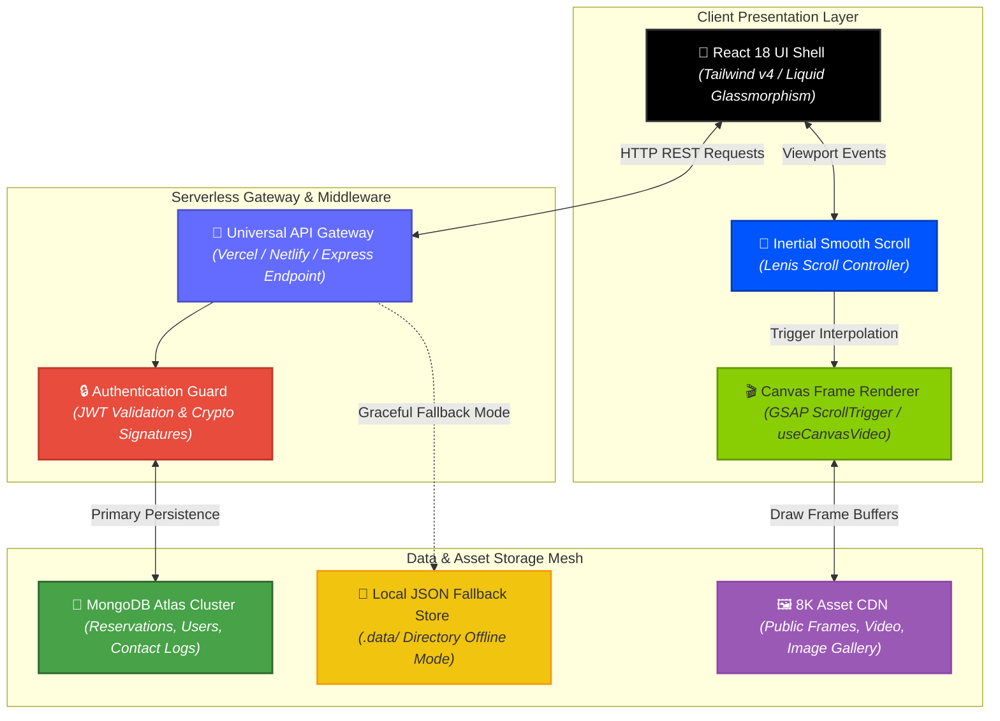
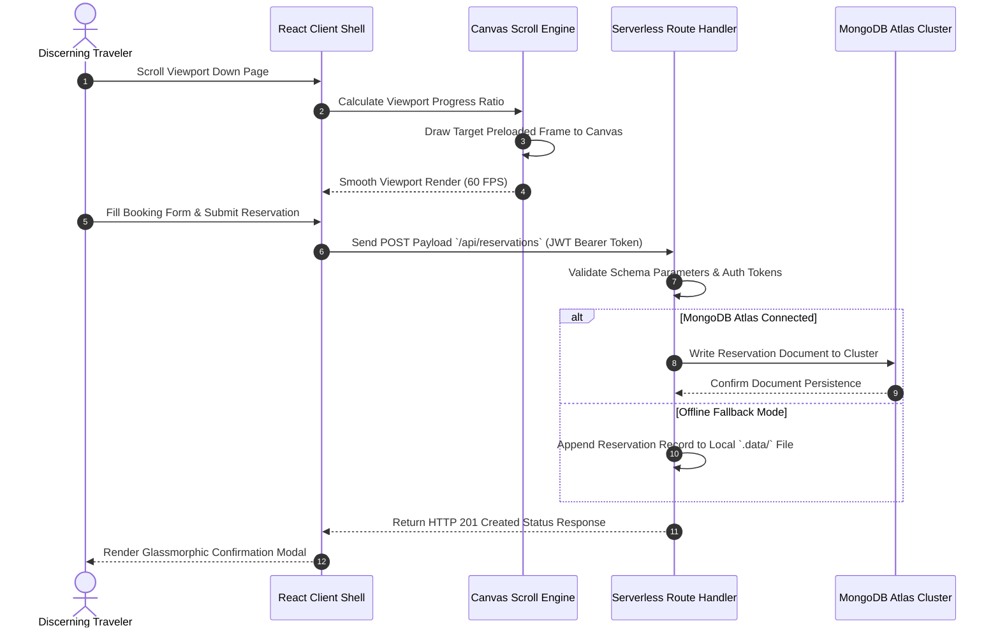

<div align="center">

# ✈️ Horizon Travels

### High-Fidelity Luxury Travel Experience Platform, Canvas Frame Animation Engine & Serverless Booking Gateway

**Horizon Travels** is a high-performance luxury travel web application designed to showcase exclusive global stays, private aviation on-demand, and custom-curated travel experiences. Built with React 18, Vite, and Tailwind CSS v4, the platform features high-resolution canvas-driven scroll animations (GSAP ScrollTrigger + Lenis), a liquid glassmorphic UI design, and serverless API handlers backed by MongoDB Atlas with automatic offline local data fallback.

<p align="center">
  
  
  
  
  
  
  
</p>

<p align="center">
  <a href="https://github.com/shreeharsh-patil/Travel-Agency/stargazers"></a>
  <a href="https://github.com/shreeharsh-patil/Travel-Agency/issues"></a>
  <a href="LICENSE"></a>
</p>

</div>

---

## 🏛️ System Architecture & Animation Pipeline

Standard media-heavy web applications often suffer from video buffer stutters and layout shifts during scroll-driven sequences. **Horizon Travels** addresses this with a **Pre-Rendered Canvas Frame Sequence Pipeline**.

High-resolution 8K image frames are preloaded into memory and rendered on an HTML5 `<canvas>` element. GSAP's ScrollTrigger interpolates active frame indices based on viewport scroll progress, while Lenis manages inertial smooth scrolling to deliver fluid, cinematic transitions at 60 FPS.



> [!NOTE]
> **Offline Reliability:** If `MONGODB_URI` is not supplied in the environment variables, the serverless layer automatically falls back to an isolated local JSON storage engine in `.data/`, ensuring full functionality during offline or static demonstration runs.

## 🔄 End-to-End Reservation & Frame Lifecycle

The sequence diagram below displays the interaction path from user scroll-triggered animation to reservation processing and serverless database storage:



## 🛠️ Production Pipeline Implementation

| Component | Technical Challenge | Our Solution Architecture |
| --- | --- | --- |
| 🎥 Scroll Animations | Playing HTML5 videos on scroll causes frame skips and mobile browser crashes. | Uses a custom `useCanvasVideo` hook that draws pre-sequenced image frames to a hardware-accelerated HTML5 `<canvas>`. |
| 🛡️ Serverless Reliability | Serverless function cold starts and missing DB environment keys interrupt API calls. | Implements a dual-mode database adapter that falls back to a local file storage engine (`.data/`) if MongoDB Atlas is unavailable. |
| 💎 UI Rendering | Heavy backdrop blur and glassmorphism filters degrade performance on mobile GPUs. | Uses hardware-accelerated CSS properties via Tailwind CSS v4 and composite layers for smooth 60 FPS rendering. |
| 🔒 Auth Security | Storing user sessions insecurely exposes access tokens to cross-site scripting (XSS). | Signs session tokens using JSON Web Tokens (JWT) verified through secure authorization header guards. |

## 🎨 Interface Showcase

## 🚀 Deployment & Local Initialization

### Platform Prerequisites

- **Runtime Sandbox Environment:** Node.js >= 18.x
- **Database Instance:** MongoDB Atlas Free Cluster (M0) or local JSON fallback

### Step-by-Step Environment Setup

**1. Repository Instantiation & Dependency Installation**

```bash
# Clone the repository
git clone https://github.com/shreeharsh-patil/Travel-Agency.git
cd Travel-Agency

# Install project dependencies
npm install
```

**2. Environment Allocation**

Copy the example environment configuration:

```bash
cp .env.example .env
```

Configure `.env` with your parameters:

```ini
PORT=3002
MONGODB_URI="mongodb+srv://<db_user>:<db_password>@cluster.mongodb.net/horizon_travels?retryWrites=true&w=majority"
JWT_SECRET="your_enterprise_cryptographic_jwt_hash_key"
```

Generate a cryptographically secure `JWT_SECRET` via terminal:

```bash
node -e "console.log(require('crypto').randomBytes(48).toString('hex'))"
```

**3. Database Seeding & Development Boot**

```bash
# Seed default gallery assets into the database
npm run seed

# Run local development environment (Starts Vite web on :5173 and Express API on :3002)
npm run dev
```

Access the web interface at: `http://localhost:5173`

## 📡 Serverless API Reference

| Method | Endpoint | Description |
| --- | --- | --- |
| POST | `/api/reservations` | Submits and records a new luxury stay or flight reservation. |
| POST | `/api/contact` | Persists user inquiry messages to the cluster ledger. |
| GET / POST | `/api/images` | Retrieves or adds image entries to the gallery dataset. |
| POST | `/api/auth/signup` | Creates a new user profile with encrypted credentials. |
| POST | `/api/auth/login` | Authenticates account credentials and returns a signed JWT. |
| GET | `/api/auth/me` | Validates session headers and returns current user details. |

## 📁 Repository Directory Architecture

```
Travel-Agency/
├─ public/                          (8K Generated Assets & Canvas Frames)
│  ├─ frames/                       (Sequential hero canvas animation frames)
│  ├─ images/                       (High-fidelity destination assets)
│  └─ videos/                       (Background media assets)
├─ src/                             (React Presentation Layer)
│  ├─ components/                   (Bento grids, navigation bars, booking modals)
│  ├─ data/                         (Static datasets for destinations and articles)
│  ├─ hooks/                        (Custom hooks: useCanvasVideo frame interpolator)
│  ├─ App.jsx                       (Primary route controllers and smooth scroll providers)
│  └─ main.jsx                      (React entry point)
├─ api/                             (Universal Serverless Function Routes for Vercel/Express)
├─ lib/                             (Database adapters & JWT authentication helpers)
├─ netlify/functions/               (Netlify catch-all function handler)
├─ package.json                     (Dependencies, scripts, and build manifest)
├─ vite.config.js                   (Vite build and proxy configuration)
└─ README.md                        (Unified platform documentation)
```

## ⚖️ Legal Guidelines & License

> [!WARNING]
> This project is distributed under the terms of the MIT License. It is built independently as an open-source engineering platform for web performance evaluation, canvas animation research, and software portfolio benchmarks.

## 👤 Project Author

Developed and Maintained by **Shreeharsh Patil**.

Feel free to contact me or submit issues via:

- **Email:** shreeharsh.dev@gmail.com
- **GitHub Profile:** [github.com/shreeharsh-patil](https://github.com/shreeharsh-patil)
